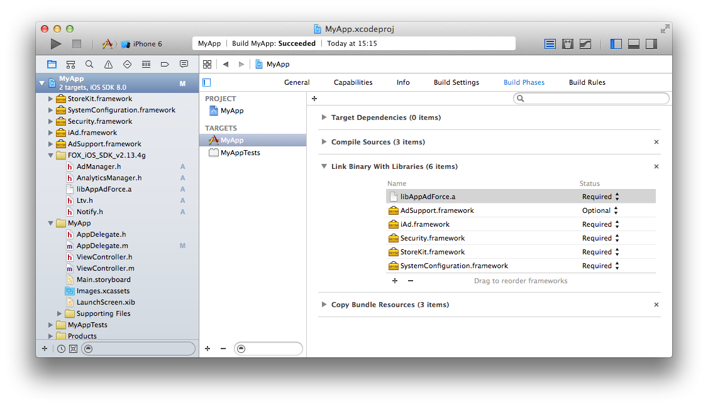
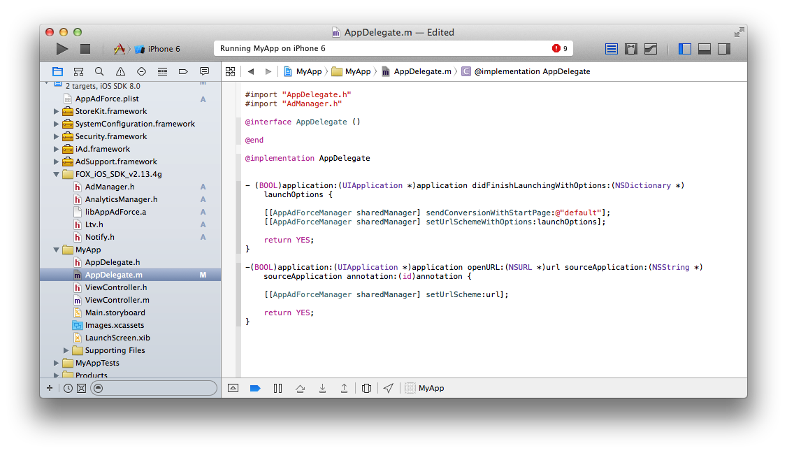

# Force Operation X是什么

Force Operation X (下面简称F.O.X)是基於智慧手机的，用来最大改善广告效果的综合解决方案平台。除了对APP下载量和网络用户操作的基本计测外，还能基於手机用户行为特性采用独自效果计测基準，实现了企业宣传推广时费用与效果比的最大改善。

在这个文档里，详细讲解了基於智慧手机平台优化广告效果的F.O.X SDK的导入步骤。

## 目录

* **[1. 导入](#install_sdk)**
	* [SDK下载](https://github.com/cyber-z/public-fox-ios-sdk/releases)
  * [导入步骤的详细](./doc/integration/README.md)
* **[2. 设定](#setting_sdk)**
  * [SDK设定的详细](./doc/config_plist/README.md)
* **[3. Install计测的安装](#tracking_install)**
	* [sendConversionWithStartPage:的详细](./doc/send_conversion/README.md)
* **[4. LTV计测的安装](#tracking_ltv)**
	* [sendLtv的详细](./doc/send_ltv_conversion/README.md)
	* [有关利用Tag的LTV计测](./doc/ltv_browser/README.md)
* **[5. 流量分析的安装](#tracking_analytics)**
  * [依靠流量分析进行Event计测](./doc/analytics_event/README.md)
  * [依靠流量分析进行付费计测](./doc/analytics_purchase/README.md)
  * [关于Engagement广告投放](./doc/fox_engagement/README.md)
* **[6. 进行疏通测试](#integration_test)**
	* [Reengagement计测时的疏通测试](./doc/reengagement_test/README.md)
* **[7. 其他机能的安装](#other_function)**
  * [Opt-Out的安装](./doc/optout/README.md)
* **[8. 最后请务必确认](#trouble_shooting)**

## F.O.X SDK是什么

在APP中导入F.O.X，可以实现如下功能

* **Install计测**

能够按不同的广告流入来计测安装数。

* **LTV计测**

按不同的广告流入来计测Life Time Value。作为主要的成果地点，有会员登录，教程突破，消费等。能够按照不同广告来监测登录率，付费率和付费额等。

* **流量分析**

自然流入和广告流入的APP安装数比较。能够计测APP的启动数，唯一用户数(DAU/MAU)，持续率等。

<div id="install_sdk"></div>

## 1. 导入
* **使用CocoaPods导入的场合**

请在Podfile文件里添加下面的设定。
```ruby
# put this line at the first of the Podfile
source "https://github.com/cyber-z/public-fox-ios-sdk.git"

# indicate FOX SDK version
pod "CYZFox", "<VERSION>"
```
> * 从`3.4.0` 开始使用[CocoaPods Private Pods](https://guides.cocoapods.org/making/private-cocoapods.html) 的方式提供SDK，请指定\<VERSION\>为 `3.4.0` 以上的版本号。
> * `3.3.0`以下的导入方法请参考[过去的历史纪录](https://github.com/cyber-z/public-fox-ios-sdk/releases)。
> * `4.0.0`以上的版本因为不具备向下兼容特性，请向Force Operation X管理员确认后再决定。

<br />

* **手动导入的场合**

请从下面的页面来下载最新的安定版（Latest release）SDK。

[SDK下载](https://github.com/cyber-z/public_fox_ios_sdk/releases)

请展开下载的SDK「FOX_iOS_SDK_<version>.zip」，把下面的文件复制到Xcode的任意一个地方，并导入到APP的项目里。

各文件的说明如下。

<table>
<tr><th>功能名</th><th>必须</th><th>ファイル名</th></tr>
<tr><td>类库本身</td><td>必须</td><td>libFoxSdk.a</td></tr>
<tr><td>Install计测</td><td>必须</td><td>AdManager.h</td></tr>
<tr><td>LTV计测</td><td>任意</td><td>Ltv.h</td></tr>
<tr><td>访问计测</td><td>任意</td><td>AnalyticsManager.h</td></tr>
</table>


[导入步骤的详细](./doc/integration/README.md)

<div id="setting_sdk"></div>

## 2. 设定

* **Framework设定**

请在项目里添加下面的Framework。

<table>
<tr><th>Framework名</th><th>Status</th></tr>
<tr><td>AdSupport.framework</td><td>Optional</td></tr>
<tr><td>Security.framework </td><td>Required</td></tr>
<tr><td>StoreKit.framework </td><td>Required</td></tr>
</table>




* **SDK设定**

为使SDK起作用，需要添加必要的设定到plist里。请在FOX管理画面里（SDK导入→平台的选择→SDK导入文档→SDK导入步骤→设定文件的下载）下载该设定文件。
或者手动在项目的任意地方建立「AppAdForce.plist」文件，并添加下面的Key和Value。

Key | Type | Value
:---: | :---: | :---
APP_ID | String | 请输入Force Operation X管理员告知的值。
SERVER_URL | String | 请输入Force Operation X管理员告知的值。
APP_SALT | String | 请输入Force Operation X管理员告知的值。
APP_OPTIONS | String | 空白。
CONVERSION_MODE | String | 1
ANALYTICS_APP_KEY | String | 请输入Force Operation X管理员告知的值。<br />不利用流量分析则不需要设定。
ANALYTICS_SERVER_URL | String | 请输入Force Operation X管理员告知的值。<br />不利用流量分析则不需要设定。


[SDK设定的详细](./doc/config_plist/README.md)

[AppAdForce.plist例子](./doc/config_plist/AppAdForce.plist)

* **关于Swift Bridging Header的编辑**

如果是使用Swift来开发，请把下列代码添加到Bridging Header文件中。
```objc
#import "AdManager.h"
#import "Ltv.h"
#import "AnalyticsManager.h"
```

<div id="tracking_install"></div>

## 3. Install计测的安装

安装了初次启动时的Install计测处理，就能够测定广告效果了。
另外，在iOS9环境初回启动时，从浏览器启动到返回APP的时候，会跳出对话框。
在F.O.X SDK里，从iOS9开始提供新WebView形式，在初回启动时使用这个新形式的“SFSafariViewController”来计测的话，可以禁止弹出对话框来提高用户体验。

为了进行Install计测，请安装下面两个方法。

方法 | 安装地点 | 概要
:---: | :---: | :---
setStartPageVisible|didFinishLaunchingWithOptions:|(可选) 请确保在sendConversionWithStartPage之前执行。设定为`NO`时，SFSafariViewController将被隐藏而不再显示。(默认为`YES`)
sendConversionWithStartPage:|didFinishLaunchingWithOptions:|(必须) 初次启动时的Install计测
setUrlScheme:|openURL:|(必须) 初次启动的Install计测控制以及URL Scheme的响应处理

请编辑项目的源代码，仿照下面来安装到Application Delegate的`application:didFinishLaunchingWithOptions:`

```objective-c
#import "AdManager.h"

// - (BOOL)application:(UIApplication *)application
//   didFinishLaunchingWithOptions:(NSDictionary *)launchOptions {

  [[AppAdForceManager sharedManager] sendConversionWithStartPage:@"default"];

  return YES; // 为了调用openURL:请确保返回YES
// }
```
在`sendConversionWithStartPage:`的参数里，通常请按上面那样输入@"default"这样的字符串。

```objective-c
// - (BOOL)application:(UIApplication *)application openURL:(NSURL *)url
//                sourceApplication:(NSString *)sourceApplication annotation:(id)annotation {

          [[AppAdForceManager sharedManager] setUrlScheme:url];

          return YES;
// }
```

> `sendConversionWithStartPage:`这个方法在iOS9环境且用Cookie计测的时候，启动SFSafariViewController来做计测。

> `setUrlScheme:`这个方法在广告经由URL Scheme跳转到APP的Install计测和启动SFSafariViewController的时候要进行控制处理，请一定在安装代码里调用`openURL:`方法。

> ※使用 ”`openURL:(NSURL *)url options:(NSDictionary<NSString*, id> *)options`”的时候，也请安装setUrlScheme:这个方法。




[sendConversionWithStartPage:的详细](./doc/send_conversion/README.md)


* **Fingerprint计测的注意事项**

Fingerprint计测使用WebView，使用独自的定制化UserAgent的时候，将无法正常计测。
在定制化WebView的UserAgent处理之前，请务必安装下面的方法。
```objc
[[AppAdForceManager sharedManager] cacheDefaultUserAgent];
```

<div id="tracking_ltv"></div>

## 4. LTV计测的安装

通过在会员登录，教程突破，付费等任意的成果地点安装LTV计测，能够测定不同广告流入的LTV。如果不做LTV计测，可以省略本项目的安装。

```objective-c
#import "Ltv.h"
// ...
AppAdForceLtv *ltv = [[[AppAdForceLtv alloc] init] autorelease];
[ltv sendLtv:{成果地点ID}];
```

为了进行LTV计测，必须指定识別各成果地点的成果地点ID。请指定到sendLtv的参数发行的ID。

进行付费计测的时候，请仿照下面的例子在完成付费处理的地方指定付费额和货币代码。

```objective-c
#import "Ltv.h"
// ...
AppAdForceLtv *ltv = [[[AppAdForceLtv alloc] init] autorelease];
[ltv addParameter:LTV_PARAM_PRICE:@"9.99"];
[ltv addParameter:LTV_PARAM_CURRENCY:@"USD"];
[ltv sendLtv:{成果地点ID}];
```

LTV_PARAM_CURRENCY的值，请按[ISO 4217](http://ja.wikipedia.org/wiki/ISO_4217)定义的货币代码来指定。

[sendLtv的详细](./doc/send_ltv_conversion/README.md)

[有关利用Tag的LTV计测](./doc/ltv_browser/README.md)

<div id="tracking_analytics"></div>

## 5. 流量分析的安装

自然流入和广告流入的安装数比较。能够计测APP的启动数，唯一用户数(DAU/MAU)，持续率等。如果不做流量分析，可以省略本项目的安装。

为了计测APP的启动和计测从后台到前台的恢复，请在application:didFinishLaunchingWithOptions:以及applicationWillEnterForeground里添加代码。


※使用background fetch技术的场合，后台启动状态下也会调用
application:didFinishLaunchingWithOptions:方法，为确保不执行启动计测，请用applicationState做状态判定。


```objective-c
#import "AnalyticsManager.h"

// - (BOOL)application:(UIApplication *)application
//   didFinishLaunchingWithOptions:(NSDictionary *)launchOptions {

    If ([application applicationState] == UIApplicationStateBackground) {
        //Background时的处理
    } else {
        //Background状态下不会被执行
        [ForceAnalyticsManager sendStartSession];
    }

//}

// - (void)applicationWillEnterForeground:(UIApplication *)application {

    [ForceAnalyticsManager sendStartSession];

//}
```

请一定在上面两个地方实际安装sendStartSession。

[依靠流量分析进行Event计测](./doc/analytics_event/README.md)

[依靠流量分析进行付费计测](./doc/analytics_purchase/README.md)

[关于Engagement广告投放](./doc/fox_engagement/README.md)


<div id="integration_test"></div>

## 6. 进行疏通测试

在APP上架申请以前，在导入SDK的状态请做充分的测试，以确保APP的动作没有问题。

由于在启动后只发生一次Install计测的通信，如果想要再次进行Install计测的话，请卸载APP再次安装

**测试步骤**

1. 如果测试用的设备已安装APP，请先卸载掉APP<br />
1. 清除测试移动终端默认浏览器Safari的Cookie请按「设定」→「Safari」→「Cookie和数据消除」删除Cookie<br />
1. 复制鄙司发行的【安装用测试URL】，粘贴到默认浏览器（标準浏览器）的URL栏里进行访问。<br />
＊请在管理画面（SDK导入→平台的选择→SDK导入文档→测试URL→安装用测试URL）里取得【安装用测试URL】。<br />
＊请一定在OS设定的默认浏览器里粘贴测试URL来发出请求。邮件APP或QR码读取APP等这些APP内部会用WebView发生的画面跳转是无法计测的。<br />
1. 画面移转到Market<br />
＊使用测试URL，可能会因为没有设定跳转目的地（没有在APP详细里设定「商城URL」）而弹出错误对话框，这个不影响测试。<br />
1. 在测试终端上安装测试APP<br />
1. 启动APP（F.O.X设定和不同测试终端会影响APP启动后的举动，请参考下面的说明）<br />
＊如果没有勾选cookie计测手法，Safari浏览器将不会弹跳出来。<br />
＊如果勾选了cookie计测手法，并且使用iOS9以下的测试终端，浏览器将自动弹跳出来<br />
＊如果勾选了cookie计测手法，并且使用iOS9及以上的测试终端，会启动SFSafariViewController。但是如果设定了`setStartPageVisible:NO`的话，SFSafariViewController和Safari都不会启动。<br />
＊如果没有出现上述的举动，说明没有正常设定。请重新设定，若仍无法发现问题，请与弊司联系。<br />
1. 把画面移转到LTV计测地点<br />
＊如果登录了LTV地点执行此步骤<br />
1. 结束并从后台关闭APP<br />
1. 再次启动APP<br />

请告诉鄙司3，6，7，9的时间。在鄙司这边会确认是否正常被计测。待确认没有问题的时候，测试算正式完成。

[Reengagement计测时的疏通测试](./doc/reengagement_test/README.md)

<div id="other_function"></div>

## 7. 其他机能的安装

* [Opt-Out的安装](./doc/optout/README.md)

<div id="trouble_shooting"></div>

## 8. 最后请务必确认（到现在发生过的问题集）

### 8.1. F.O.X里使用的BundleVersion是什么？

在iOS里BundleVersion具体是指下面两个值。

* CFBundleVersion
* CFBundleShortVersionString

在F.O.X里，使用上面的CFBundleShortVersionString值来做管理。

### 8.2. 查看经由广告进来的安装数，期待的数字比报告里的统计数字要低。

Install计测的`sendConversionWithStartPage:`没有被安装到一启动即执行的地点，在到达那个地点前脱离的用户将不会被统计。

没有特別的理由请将`sendConversionWithStartPage:`安装在`application:didFinishLaunchingWithOptions:`里面。安装在別的地点可能无法正确计测安装数。

在没有安装`application:didFinishLaunchingWithOptions:`的状态下投放安装成果型广告的时候，请一定事先通知广告代理店或者媒体负责人。不能正常计测的状态下投放安装成果型广告，可能被要求支付超过计测安装数的广告费用。


### 8.3. 未设定URL Scheme发布的APP引起无法从浏览器跳转到APP

为了进行Cookie计测，在启动外部浏览器以后，要利用URL Scheme跳转到APP来返回到原来的画面。这时有必要设定独自的URL Scheme，未设定URL Scheme发布的APP将无法正常跳转。

### 8.4. URL Scheme里包含了大写字母，无法正常跳转回APP

由于环境的不同，可能无法判別URL Scheme里的大小写字母，进而引起不能正常跳转。因此URL Scheme请全部使用小写字母来设定。

### 8.5. 由于设定的URL Scheme与其他APP的相同，导致了从浏览器跳转到了其他APP

在iOS里，如果设定同一个URL Scheme到多个APP，启动哪个APP是不确定的。因此设定URL Scheme的时候，请使用唯一的有一定复杂度的字符串。

### 8.6. 进行了在短时间获得大量用户的宣传推广但无法正常计测

在iOS里，启动APP时一旦主线程被阻挡超过一定时间，APP奖被强制关闭。启动时的初期化处理请不要在主线程里向服务器进行同期通信。像成果报酬型广告这类的在短时间获取大量用户的方式，会产生向服务器的集中访问，通信响应变得非常差，APP的启动会花费更长时间，这种状况下启动APP会发生强制关闭而无法计测成果的问题。

这种状况下请按下面的步骤来测试，按照下面的设定确认APP可否正常启动。

`iOS「设定」→「DEVELOPE」→「NETWORK LINK CONDITIONER」``

* 开启「Enable」
* 勾选「Very Bad Network」

---
[主菜单](../../README.md)
