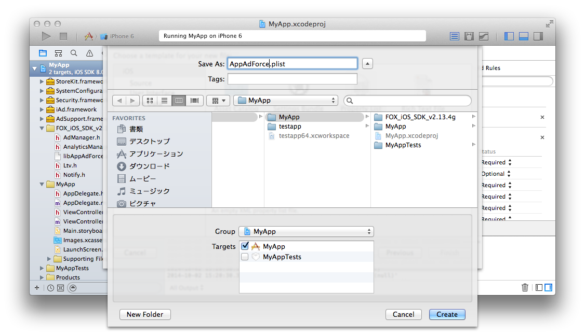

## SDK设定的详细

追加必要的设定让SDK发挥作用。新建「AppAdForce.plist」这样一个Property List文件放到项目的任意一个地方，并输入下面的Key和Value。

在任意地点点击右键→选择「New File...」

选择「Property List」。

变更成「AppAdForce.plist」这个名称、点击Create按钮。

选择新建的Property List文件，用右键打开菜单，选择Add Row」

设定各个Key和Value。

设定的Key和Value如下。

Key | Type | Value
:---: | :---: | :---
APP_ID | String | 请将由Force Operation X管理者通知的数值输入。
SERVER_URL | String | 请将由Force Operation X管理者通知的数值输入。
APP_SALT | String | 请将由Force Operation X管理者通知的数值输入。
APP_OPTIONS | String | 请空白。
CONVERSION_MODE | String | 请输入1
ANALYTICS_APP_KEY | String | 请将由Force Operation X管理者通知的数值输入。 不利用流量分析的场合没有必要设定

[AppAdForce.plist例子](./AppAdForce.plist)

---
[TOP](/lang/zh-tw/README.md)
