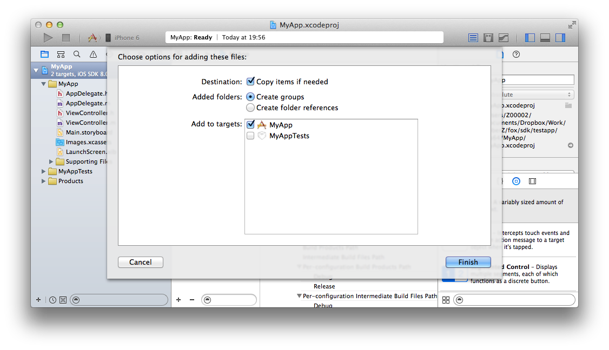

## 导入步骤的详细

请解压下载的SDK「FOX_iOS_SDK_<version>.zip」，把下面的文件复制到Xcode的任意一个地方，并导入到APP的开发项目里。

各文件的说明如下。

<table>
<tr><th>功能名</th><th>必须</th><th>ファイル名</th></tr>
<tr><td>类库本身</td><td>必须</td><td>libAppAdForce.a</td></tr>
<tr><td>Install计测</td><td>必须</td><td>AdManager.h</td></tr>
<tr><td>LTV计测</td><td>任意</td><td>Ltv.h</td></tr>
<tr><td>访问计测</td><td>任意</td><td>AnalyticsManager.h</td></tr>
</table>

---
[TOP](/lang/zh-tw/README.md)
