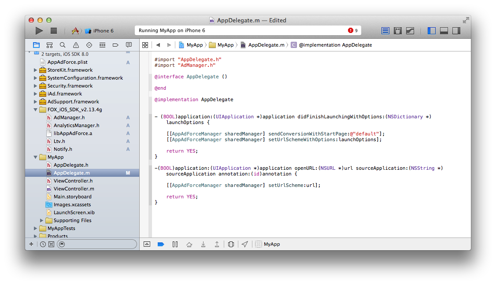

## sendConversionWithStartPage:的详细

利用`sendConversionWithStartPage:`方法能够进行Install计测。如果使用Cookie计测手法，外部浏览器将被启动。这个时候，可以把外部浏览器的跳转目的地用字符串形式指定到`sendConversionWithStartPage:`的参数里。

编辑项目的源代码，请按下面那样来安装到Application Delegate的`application:didFinishLaunchingWithOptions:`里。

> 【注意事项】
没有特別的理由请将`sendConversionWithStartPage:`安装在`application:didFinishLaunchingWithOptions:`里面。安装在別的地点可能无法正确计测安装数。
在没有安装`application:didFinishLaunchingWithOptions:`的状态下投放安装成果型广告的时候，请一定事先通知广告代理店或者媒体负责人。不能正常计测的状态下投放安装成果型广告，可能被要求支付超过计测安装数的广告费用。

```objective-c
#import "AdManager.h"

// - (BOOL)application:(UIApplication *)application
//   didFinishLaunchingWithOptions:(NSDictionary *)launchOptions {

[[AppAdForceManager sharedManager] sendConversionWithStartPage:@"default"];

// }
```

通常在sendConversionWithStartPage:的参数里像上面那样输入@"default"。默认是显示準备好的标準页面，可以在FOX管理画面里任意设定跳转目标页面的URL。



想要跳转至特定URL的场合，或者用APP动态生成URL的场合，请设定URL字符串。

```objective-c
[[AppAdForceManager sharedManager] sendConversionWithStartPage:@"http://yourhost.com/yourpage.html"];
```
代替`sendConversionWithStartPage:`使用`sendConversionWithStartPage:buid:`方法、能够输出广告主终端设备ID到成果LOG里。比如，如果想用APP起动时生成的UUID和初次启动的成果绑定到一起做管理，可以利用这个方法。

```objective-c
[[AppAdForceManager sharedManager] sendConversionWithStartPage:@"http://yourhost.com/yourpage.html" buid:@"{your uniq id}"];
```
> 作为刚启动后的处理需要实际安装`sendConversionWithStartPage:buid:`，但像登录ID这样的用户行为相伴的值无法通过参数传递。

## Fingerprint计测的注意事项

Fingerprint计测使用WebView，使用独自的定制化UserAgent的时候，将无法正常计测。
把WebView的UserAgent定制化成特定字符串之前，请一定安装下面的方法。

```objective-c
[[AppAdForceManager sharedManager] cacheDefaultUserAgent];
```

## 3.2.	v2.16g以前旧版本的场合

到现在，进行Reengagement计测的时候，需要在`didFinishLaunchingWithOptions:`里安装`setUrlSchemeWithOptions:`方法。由于已经统合到`setUrlScheme:`方法里了，从本文档开始不再需要安装。

[削除]
```objective-c
  [[AppAdForceManager sharedManager] setUrlSchemeWithOptions:launchOptions];
```

此外，为了保持向下兼容性，可以按过去的那种方式来调用。


---
[TOP](/lang/zh-tw/README.md)
